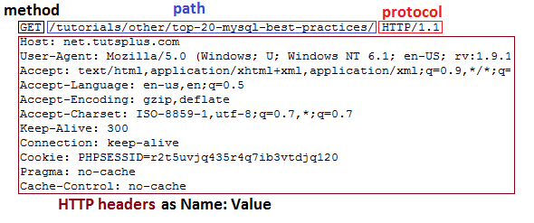
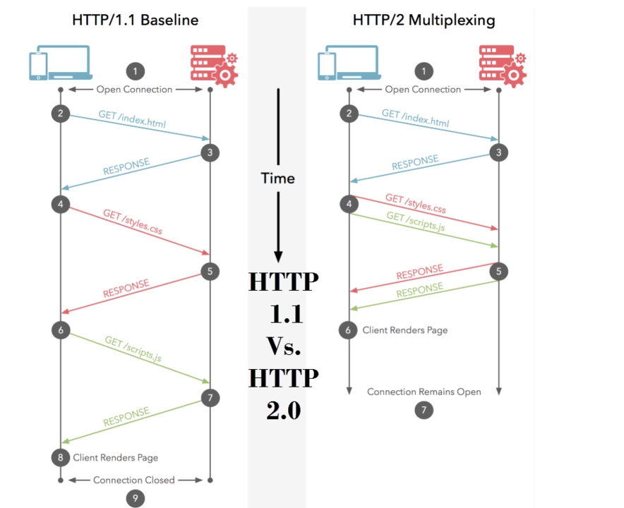

## [How the Internet works](https://www.youtube.com/watch?v=7_LPdttKXPc)

### Internet

- The **internet** is a wire buried in the ground.
- Two computers connected directly to this wire can communicate.

### Server

- A **server** is a special computer connected directly to the internet, web pages/files on it's hard drive.
- Every server has a unique internet protocol (IP) address.
- IP addresses help computers find each other.
- IP addresses are given names, so we can use them easily.

### Client

- Your computer is a client, it's connected indirectly to the internet through an Internet Service Provider (ISP).
- I use my laptop with DSL, go through my ISP onto the internet and look at _google.com_, my laptop connects with _google.com_ and I can look at its web pages.

### Packets

- Whenever an email/picture/web page travels across the internet, computers break the information int smaller pieces called **packets**.
- When information reaches its destination, the packets are reassembled
  in their original order.

### IP Addresses and Routers

- Everything connected directly or indirectly to the internet has an IP address.
- Anywhere two or more parts of the internet intersect, there's a piece of equipment called a **router**.
- Routers direct your packets around the internet, helping each packet get one step closer to its destination.
- Every time you visit a website, upwards of 10 to 15 routes may help your packets find their way to and from your computer.
- Imagine each packet as a piece of candy wrapped in several layers, the first layer is your computer's IP address, your computer sends the packet to the first router which adds its own IP address, each time the packet reaches a new router, another layer is added until it reaches the server, then when the server sends back information, it creates packets with an identical wrapping, as the packet makes its way over the internet back to your computer, each router unwraps a layer to discover where to send the packet next until it reaches your computer not anyone else.

## [HTTP](https://www.youtube.com/watch?v=iYM2zFP3Zn0)

### HTTP

- Hyper Text Transfer Protocol.
- Responsible for communication between web servers & clients.

### HTTP Is Stateless

- Every request is completely **independent**.
- When you make one request visiting a web page, or you go to another page after that, or reload the page, it doesn't remember anything about the previous one.
- Each request is a single transaction.
- Programming, local storage, cookies, sessions are used to create enhanced user experiences.

### HTTPS

- Hyper Text Transfer Protocol Secure
- Data sent is encrypted by **SSL Secure Sockets Layer** or **TLS Transport Security Layer**.
- When users send sensitive info, it should always be over https (credit card data/security numbers, etc..).
- A lot of websites and apps now forces https on every page, by installing an SSL certificate on web host.

### HTTP Methods

- **GET**
  - Retrieves data from the server.
  - Every time you visit a web page, you're making a get request to the server via http.
- **POST**
  - Submit data to the server.
- **PUT**
  - Update data already on the server.
- **DELETE**
  - Deletes data from the server.

### HTTP Header Fields

- With each request and response using http, you have something called **header** and **body**.
- The **body** with a response is going to be the html page you're trying to load.
- 

  |       General    |    Response    |     Request    |
  | :--------------: | :------------: | :------------: |
  |  Request URL     |    Server      |     Cookies    |
  |   Request Method |    Set-Cookie  |     Accept-xxx |
  |      Status Code |  Content-Type  |   Content-Type |
  |   Remote Address | Content-Length | Content-Length |
  |  Referrer Policy |     Date       |  Authorization |
  |                  |                |   User-Agent   |
  |                  |                |   Referrer     |

- Remote address: IP of the remote computer.
- Referrer policy: if you go to a page from another page, it might have some information on that.
- Server: Apache, Nginx, or else.
  - A lot of times it _hidden_ to prevent hackers from knowing what type of server the website uses.
- Set-Cookie: used for servers to send small pieces of data called _cookies_ from the server to the client.
- Content-Type: every response has a content type.
  - HTML: Text/HTML.
  - CSS: Text/CSS.
  - Image: Image/png  -  image/jpeg.
  - Json: Application/Json.
- Content-Length: the length in octal.
- Accept-xxx:
  - Accept-Coding.
  - Accepts-Charset.
  - Accepts-Language.
- Authorization: HTTP is stateless, so you need to send some type of token within the header, so you can "for ex" validate the user to access a protected route.
- User-Agent: a long string that has to do with the SW/OS/Browser the user is using.
- Referrer: has info regarding the referring site.

### HTTP Status Codes

- **1xx: Informational**
  - Request received/processing.
- **2xx: Success**
  - Successfully received, understood and accepted.
- **3xx: Redirect**
  - Further action must be taken / redirect.
- **4xx: Client Error**
  - Request doesn't have what it needs.
- **5xx: Server Error**
  - Server failed to fulfill an apparent valid request.
---
- **Common Status Codes:**
- **200** - OK
- **201** - OK created.
- **301** - Moved to new URL.
- **304** - Not modified (cached version).
- **400** - Bad request.
- **401** - Unauthorized.
- **404** - Not found.
- **500** - Internal server error.

### HTTP/2

- Major version of HTTP.
- Under the hood changes.
  - You don't have to change the way your applications work.
- Respond with more data.
- Reduce latency by enabling full request and response multiplexing.
- Fast, efficient and secure.

- 

## [DNS](https://www.youtube.com/watch?v=72snZctFFtA)

### What is DNS

- Domain Name System.
- One of the most important and overlooked parts of the internet.
- Without DNS, the internet would collapse.
- Computers that make up the internet are set up in large networks that communicate with each other via underground(or underwater), wires and identified using strings known as **IP addresses**.
- DNS is used to _translate_ an actual name into this numbers "in DNS".
- DNS was designed to work extremely fast and efficient.

### How DNS Works

- When you type _www.google.com_ in the browser, you are actually going to **www.google.com.**
- The end dot _._ represents the root of the internet's name space.
- When you search for _www.google.com._, your browser and operating system will first determine if they know what the IP address is already, it could be configured in your pc or in memory _cache_.
- The browser asks the OS and they both don't know where _www.google.com._ is.
- The OS is configured to ask a **resolving name server** _the workhorse of the DNS lookup, it's either configured manually or automatically within your OS_ for IP addresses it doesn't know.
- The resolving name server may or mat not have this in the memory 'cache'.
- The only thing that all resolving name servers should know is where to find the **root name servers**.
- The root name servers will reply with "I don't know, but I do know where to find the **COM name servers**, try there!".
- The COM name servers are called the **Top Level Domain (TLD)** name servers.
- The resolving name server then takes all of this info from the root name servers, puts it in its cache, and then goes directly to the COM TLD name servers.
- When the resolving name server queries _www.google.com_, the TLD name server responds "I don't know, but I do know where to find the _google.com_ name servers, try there!".
- This next set of name servers are the **authoritative name servers**.
- How did the COM TLS name servers know which authoritative name server to use?
  - With the help of the **domain's registrar**.
  - When a domain is purchased, the registrar is told which which authoritative name servers that domain should use.
  - They notify the organization responsible for the TLD (the registry), and tell them to update the TLD name servers.
- The resolving name server takes the response from the TLD name server, stores it in cache, and then queries the _google.com_ name servers.
- The authoritative name server will say "I know where that is! Tell your browser to go to the IP address _ex: 192.168.1.1_".
- The resolving name server takes this info from the authoritative name server, puts it in cache, and gives the reply to the OS.
- The OS gives this to the browser.
- The browser makes a connection to the ip address requesting the web page for _www.google.com_

## [How the Web Works](https://developer.mozilla.org/en-US/docs/Learn_web_development/Getting_started/Web_standards/How_the_web_works)

## [TCP/IP Model](https://www.youtube.com/watch?v=OTwp3xtd4dg)

### What's TCP/IP Model

- A model designed to standardize computer networking.
- Numbered from the bottom up, but the direction depends on if you're sending or receiving traffic.

  |   | Original Mode |   |  New Model  |   |   OSI Model  |
  |:-:|:-------------:|:-:|:-----------:|:-:|:------------:|
  | 4 |  Application  | 5 | Application | 7 |  Application |
  |   |               |   |             | 6 | Presentation |
  |   |               |   |             | 5 |    Session   |
  | 3 |    Transport  | 4 |  Transport  | 4 | 
  | 2 |    Internet   | 3 |   Network   | 3 |
  | 1 |      Link     | 2 |  Data Link  | 2 |
  |   |               | 1 |   Physical  | 1 |

- **Application protocols:** HTTP, FTP, SMTP.
- **Transport protocols:** 
  - TCP, UDP.
  - Port numbers are also added here.
- **Network layer:** IP, Routers.
- **Date link layer:** contains ethernet, switches.
- **Physical layer:** every thing we can touch and feel, like: cables and network interface cards _NIC_.

### Sending and Receiving Data:

- **Encapsulation**: when we send data, each layer will add its own bit of information.
- When we reach the physical layer, the data is transmitted over the receiving device.
- The receiving device starts to **decapsulate** the data.
- We start with our app data at layer 5 _application layer_.
- Then passed down to the next layer where the _transport_ info is added
  - Ex: a TCP header is added, each time it's added, this will contain specific info, like:
    - source and destination port number,
    - sequence numbers,
    - and more.
- We then move to the network layer where we add the _IP_ header, this will contain the source and destination IP address and other more bits of info.
- Lastly, we have the data link layer where we don't only add a header but a trailer as well.
  - The header contains mainly the source and destination MAC address.
  - The trailer contains some error checking info that the receiving side can check and make sure the data has been received correctly.

  |          |    |     |      |          |   | Data Name |
  |:--------:|:--:|:---:|:----:|:--------:|:-:|:---------:|
  |          |    |     | Data |          | 5 |           |
  |          |    | TCP | Data |          | 4 |  Segment  |
  |          | IP | TCP | Data |          | 3 |   Packet  |
  | Ethernet | IP | TCP | Data | Ethernet | 2 |    Frame  |

- Once data has been transmitted, the receiving computer _decapsulate_ the info.
- It will check the destination MAC address for that frame and if the frame is destined for our computer, it's processed further.
- The computer then checks the IP info of the packets again if the packet is destined for our computer it's processed further.
- The transport information is read and the app data is sent to the receiving app.
  

## [TCP vs UDP Comparison](https://www.youtube.com/watch?v=uwoD5YsGACg)

### TCP

- Transmission Control Protocol.
- TCP is used to ensure that connection between two devices is good and reliable, and data is received correctly without any loss.
- It's a connection oriented protocol, it must first acknowledge a session between the two devices communicating.
- A device sends a message **SYN**, the receiving device sends back a **SYN ACK** telling the sender it has received the message, then the sender sends **ACK Received**, the data then can be delivered.

### UDP

- User Datagram Protocol.
- A _connectionless_ oriented protocol, it doesn't establish a session, and doesn't ensure data delivery.
- It's faster than UDP.
