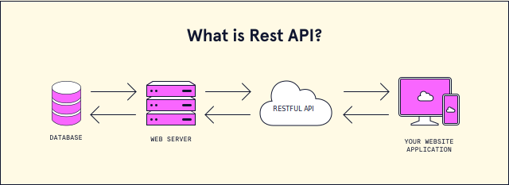

## [REST API](https://www.youtube.com/watch?v=qbLc5a9jdXo)

### API

- Application Programming Interface.
- A way two pieces of software can communicate with one another.

### REST API

- REpresentational State Transfer.
- Describes how we are communicating over the web.
- Instead of getting HTML, you get a _JSON_.
  - JSON _JavaScript Object Notation_: 
    - a notation of describing information, it's like a text.
    - It doesn't have to be done with Js.
    - It's the standard for APIs.
- 
- Why don't we access the database directly?
  1. Security: all data will be available to anyone.
  2. Versatility so we can access the same data from website/mobile app.
  3. Modularity: frontend and backend are separated, so we need something between to enable communication.
  4. You gave a consistent interface, so when anything changes in the backend _ex: prog lang_, the frontend won't be affected. 
  5. The APIs could be public and used.

### Request Methods

- **GET**
  - Retrieve data from the server.
- **POST**
  - Add new data on the server.
  - Ex: /posts
- **DELETE**
  - Delete data from the server.
- **PUT**
  - Update data.
  - Ex: /posts/4
  - Guaranteed to be executed multiple times without any side effects _"idempotent"_.
- **PATCH**
  - It updates only specific fields.
  - Not always idempotent.

## [Postman Beginner's Course - API Testing](https://youtu.be/VywxIQ2ZXw4?si=zy-Mi3944P-6dOnP)
