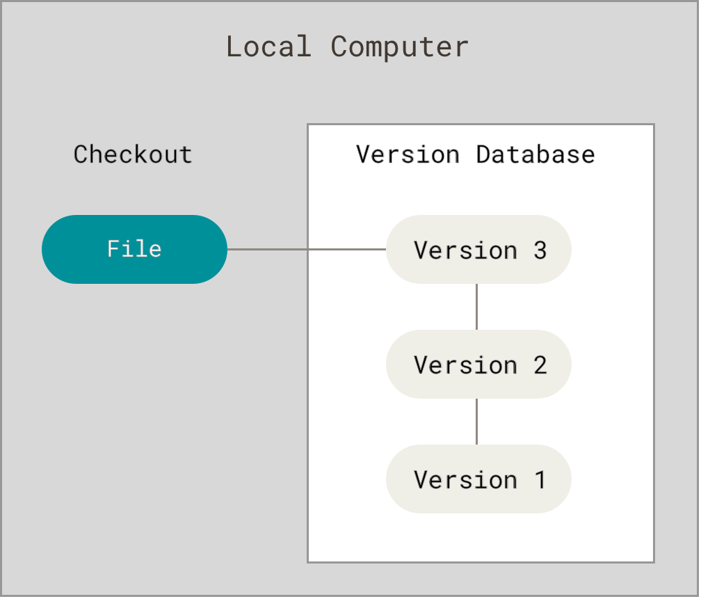
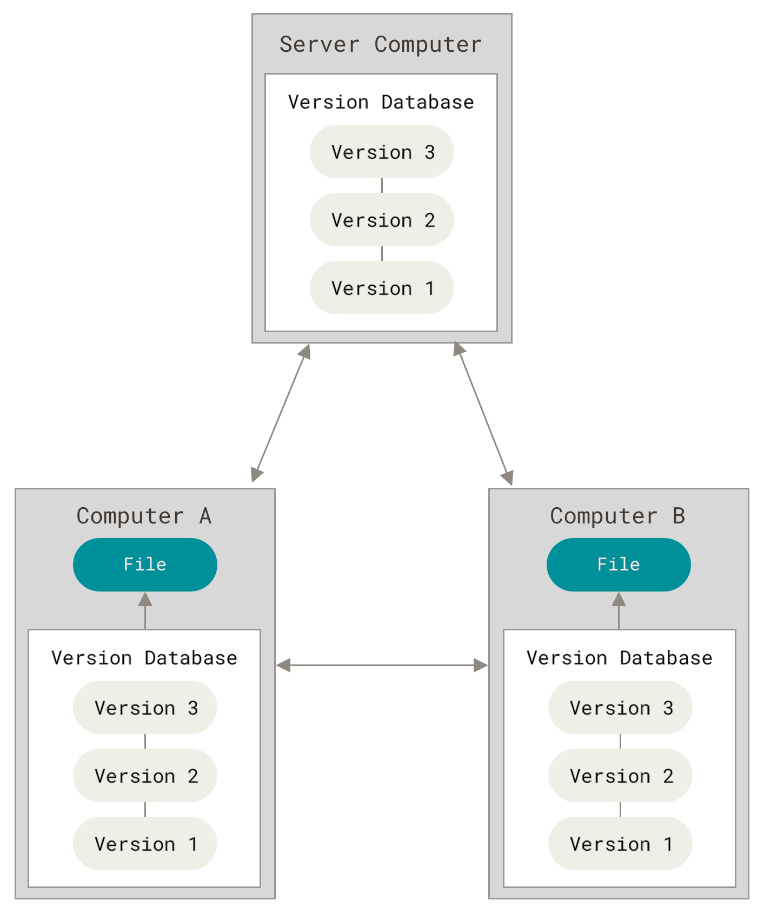

## [Git Tutorial](https://www.youtube.com/watch?v=HVsySz-h9r4)

### Central VCS vs. Distributed VCS

- **Central VCS (SVN)**
    - 
    - is located in one place, so people can checkout from the central location, make their changes, and then check everything back.
    - If the server is offline or you don't have a network connection, then you'll only be able to see the files you've checked out from that repo and no additional info about that central remote repo.
- **Distributed VCS (GIT)**
    - 
    - Everybody has a local repo.
    - Your local repo has all info the remote repo has based on the time you sync those two together.
    - Every developer has a backup.

### Basic Commands

- **Set Config Values**
    - `git config --global user.name "username"`
    - `git config --global user.email "email"`
    - `git config --list`
- **Help**
    - `git help <verb>`
        - Ex: `git help config`
    - _OR_ `git <verb> --help/-h`
        - Ex: `git config --help/-h`
- `git init`: initialize a repo from existing code.
- `git status`
- add `.gitignore` file.
    - `touch .gitignore`
- **Add files to staging area**
    - `git add .`: add all files/folders
    - `git add <filename>`: add specific file(s)
- **Remove files from staging area**
    - `git reset`: remove all files
    - `git reset <filename>`: remove specific file(s)
- **Commit**
    - `git commit -m "commit message"`
- `git log`: info about commits and authors.
- `git clone <url> <where to clone>`: clone a remote repo.
- **View info about the remote repo**
    - `git remote -v`
    - `git branch -a`: all of branches "local and remote"
- **Pushing changes**
    - commit changes
        - `git diff`: shows changes in the code
        - `git status`
        - `git add .`
        - `git commit -m "commit message"`
    - then push
        - `git pull origin main`
        - `git push origin main`
- **Create a branch for a desired feature**
    - `git branch <name>`
    - `git checkout <name>`
- `git push -u origin <name>`: push branch to remote.
- **Merge a branch**
    - `git checkout main`
    - `git pull origin main`
    - `git branch --merged`
    - `git merge <branch_name>`
    - `git push origin main`
- **Deleting a branch**
    - `git branch --merged`
    - `git branch -d <branch_name>`
    - `git branch -a`
    - `git push origin --delete <branch_name>`
