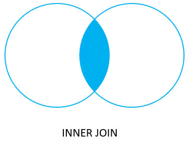
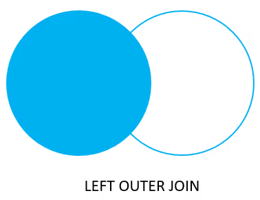
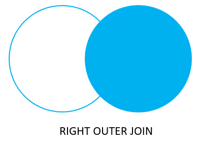
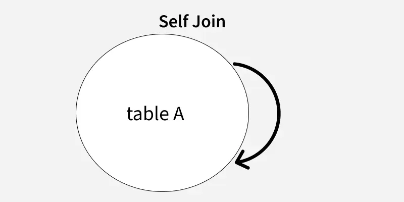
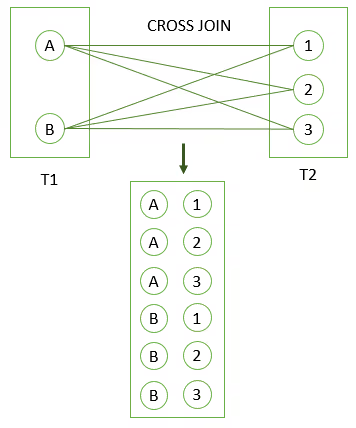
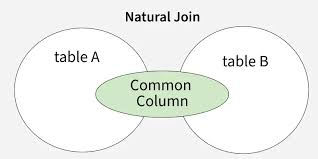

# SQL Joins

- Join is used to combine columns from one or more tables based on the values of the common columns between related tables.
- The **common** columns are typically the _primary key_ columns of the first table and the _foreign key_ columns of the second table.

## Types of Join

### Join / Inner Join

- 
- Only returns connected, matching rows.

### Left Join / Left Outer Join

- 
- Returns all connected rows, and unconnected rows from the left table (nulls in right).

### Right Join / Right Outer Join

- 
- Returns all connected rows, and unconnected rows from the right table (nulls in left).

### Self Join

- 
- A regular join that joins a table to itself.

### Full Join / Full Outer Join

- 
- Returns connected rows, and unconnected rows from both left and right tables.

### Cross Join

- 
- Join two tables by combining each row from the first table with every row from the second table, resulting in a complete combinations of all rows.
- It produces the _cartesian product_ of rows in two tables.
- Syntax:
    ```sql
    SELECT
        select_list
    FROM table1
    CROSS JOIN table2;
    ```
    ```sql
    SELECT
        select_list
    FROM table1, table2;
    ```
    ```sql
    SELECT
        select_list
    FROM table1
    INNER JOIN table2 ON true;
    ```

### Natural Join

- 
- A join that creates an implicit join based on the same column names in the joined tables.
